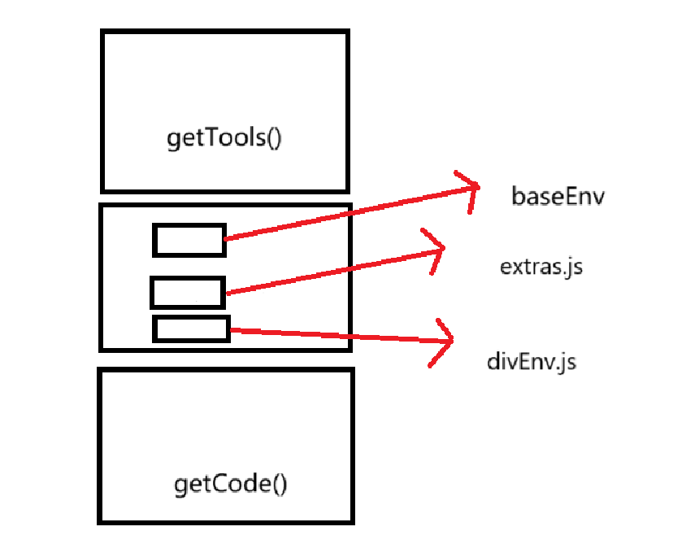

# web 逆向的补环境框架
当我遇见 shape 才醒悟：web 端，补环境才是最终的答案。

# 命名规范
变量：下划线命名法；函数：小驼峰命名法；类：大驼峰命名法

# 文件结构
## baseEnv
存放可以写死的环境代码，即便换网站也可以不用改动的代码放入其中

## examples
存放要补环境的代码

## script
存放一些脚本，方便去浏览器批量获取指纹等

## supplement
对 baseEnv 进一步补充，存放补环境过程中可能会用到一些工具的代码和自定义代码（extras.js、divEnv.js）
### extras.js
呈上启下的中间层
### divEnv.js
自定义环境，不同的网站会有不同的环境代码。

## utiles
框架会用到的工具函数

## main.js
入口，更改配置、拼接代码、运行。
### 配置注释
```js
let init_config = {
    is_proxy: true,                         // 是否代理对象
    is_hook_proxyhandler: false,            // 是否拦截代理对象的 get、set、has 等句柄
    is_print: true,                         // 是否用 console.log 打印出来
    history: "",                            // 日志历史，在调试过程中，可 copy(nothing.history) 复制日志出来
    memory: {},                             // 缓存
}
```

## run.js
每次运行 main.js 都会生成一份完整代码。
### run.js 代码分布



# 创建插件的示例
```js
// 收集了几个 plugins mimeTypes 的信息，可以照着写（这里只是添加信息，还需要 new 出来，应该会写个脚本，取浏览器自动获取）。
__obj.memory.plugins = [
    {
        description: "Portable Document Format",
        filename: "internal-pdf-viewer",
        name: "PDF Viewer",
    },
    {
        description: "Portable Document Format",
        filename: "internal-pdf-viewer",
        name: "Chrome PDF Viewer",
    },
    {
        description: "Portable Document Format",
        filename: "internal-pdf-viewer",
        name: "Chromium PDF Viewer",
    },
]
__obj.memory.mime_types = [
    {
        description: "Portable Document Format",
        suffixes: "pdf",
        type: "application/pdf",
    },
    {
        description: "Portable Document Format",
        suffixes: "pdf",
        type: "text/pdf",
    },
]
// navigator.plugins
for (let i = 0; i < __obj.memory.plugins.length; i++)
{
    let tmp = __obj.memory.plugins[i];
    // 注意并不是所有的 __obj.memory.mime_types 都要赋值上，一般是选一个或几个
    tmp.mime_types = __obj.memory.mime_types;
    __obj.insert_plugins(nothing.newPlugin(tmp));
}
// navigator.mimeTypes
for (let i = 0; i < __obj.memory.mime_types.length; i++)
{
    let tmp = __obj.memory.mime_types[i];
    // 某一个 plugin
    tmp.plugin = navigator.plugins[0];
    __obj.insert_mime_types(nothing.newMimeType(tmp));
}
```
